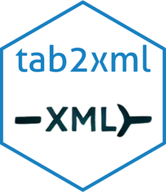

<!-- README.md is generated from README.Rmd. Please edit that file -->

```{r, include = FALSE}
knitr::opts_chunk$set(
  collapse = TRUE,
  comment = "#>",
  fig.path = "man/figures/README-",
  out.width = "100%"
)
```

# tab2xml <a href="https://josesamos.github.io/tab2xml/"></a>


<!-- badges: start -->
[](https://CRAN.R-project.org/package=tab2xml)
[](https://github.com/josesamos/tab2xml/actions/workflows/R-CMD-check.yaml)
[](https://app.codecov.io/gh/josesamos/tab2xml)
[](https://cran.r-project.org/package=tab2xml)
<!-- badges: end -->

The goal of `tab2xml` is to convert spreadsheet files (.xlsx or .ods) into structured XML documents using a predefined template. The package processes the spreadsheet data, replacing template tokens with corresponding values, and manages foreign key relationships automatically.

## Installation

You can install the released version of `tab2xml` from [CRAN](https://CRAN.R-project.org) with:

``` r
install.packages("tab2xml")
```
And the development version from [GitHub](https://github.com/) with:

``` r
# install.packages("pak")
pak::pak("josesamos/tab2xml")
```

## Example

This example demonstrates how to use `tab2xml` to convert an Excel or ODS file into an XML file, based on a schema example from the [Mondrian Documentation](https://mondrian.pentaho.com/documentation/schema.php).

```{r example}
library(tab2xml)

# Define file paths
source_xml <- system.file("extdata", "schema_template.xml", package = "tab2xml")
source_xlsx <- system.file("extdata", "schema.xlsx", package = "tab2xml")
temp_file <- tempfile(fileext = ".xml")
```


### Show spreadsheet contents

```{r, results='asis'}
sheet_names <- readxl::excel_sheets(source_xlsx)
for (sheet in sheet_names) {
  cat("\n#### Sheet:", sheet)
  data <- readxl::read_excel(source_xlsx, sheet = sheet)
  print(knitr::kable(data))
}
```

### Convert spreadsheet to XML

```{r}
file <- sheet2xml(source_xlsx, source_xml, temp_file, optimize = TRUE)
```

### Check output

```{r, results='asis'}
library(xml2)

xml_content <- readLines(file, warn = FALSE)

cat("```xml\n", paste(xml_content, collapse = "\n"), "\n```", sep = "")
```


In this way, we can organize and work with the data in tabular form and generate XML documents directly using the provided templates.

